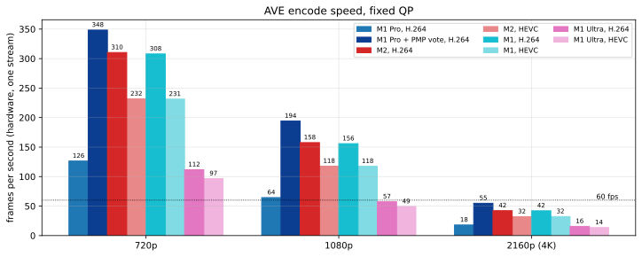
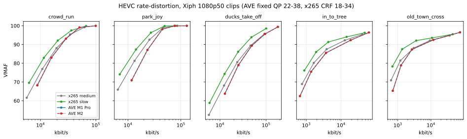
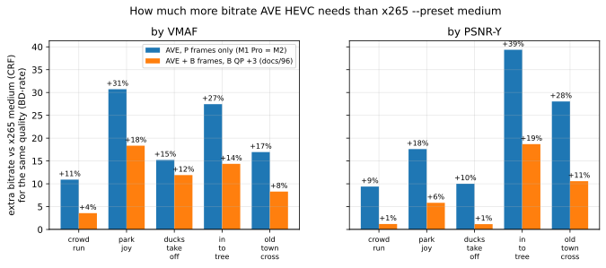
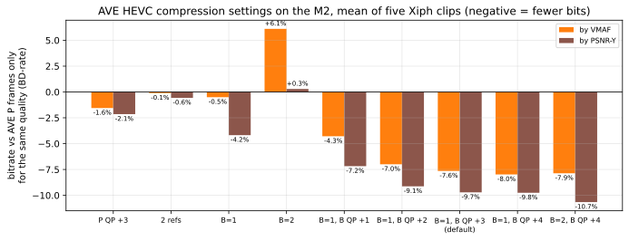
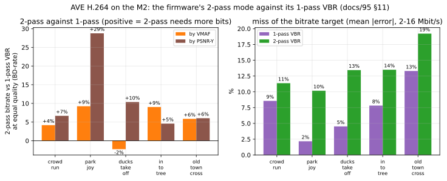
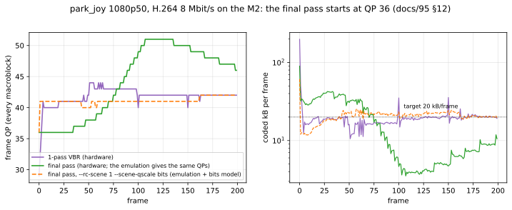
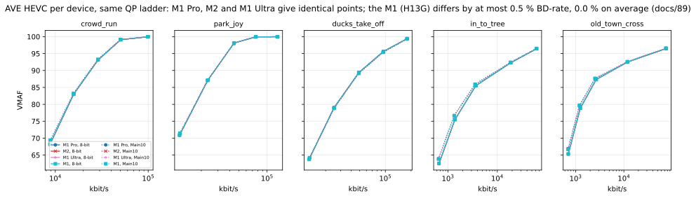
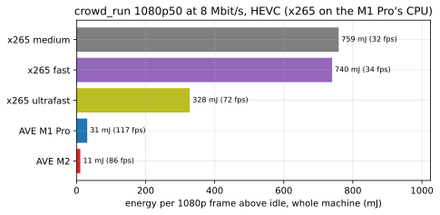

# apple-ave-driver

This repository is almost entirely AI-generated (Claude Opus models specifically, some Fable). The purpose of this work is to produce a working H.264 and HEVC Apple Video Encoder hardware driver for Linux running on M-series machines. This work was created in the interests of interoperability and allowing open source software to run efficiently on ageing hardware.

This driver is alpha work and has been used on an M1 Max, an M1 Pro, an M2 Mac mini and (by a fork's author) an M1 machine so far. Before using it, make sure it's right for you.

As per the documents the work has been tested extensively (several hours now), but has some specific shortcomings that I _largely_ don't care about.

And now... over to the machine (largely):

Reverse-engineering notes and tooling for **AVE**, the Apple Video Encoder block
on Apple Silicon, with the goal of a Linux V4L2 encoder driver.

AVE is the counterpart to AVD (the decoder, which Asahi already supports). As of
this writing there is no public AVE work in Asahi — the encoder is untouched.
This repository is the starting point for that work.

**Target hardware for the initial effort:** Apple M1 Max (`t6001`, board `j314c`),
which exposes two independent encoder instances (`ave0`, `ave1`). The **M1 Pro**
(`t6000`, board `j314s`, one encoder) followed as the first port (docs/87), and
the **M2** (`t8112`, Mac mini `j473`) as the first outside the M1 family
(docs/90). The approach should generalise across the M1 family and forward.

## Supported machines (2026-10-03)

| SoC | machines | encoders | firmware (macOS 13.5 stub) | overlay | status |
|---|---|---|---|---|---|
| `t6001` M1 Max | MacBookPro18,4/18,2 (`j314c`/`j316c`) | 2 (`apple-ave-enc`, `apple-ave1-enc`) | `AppleAVE2FW_H13C` → `apple/ave_h13c.bin` | `VARIANT=7` (both) or `4` (ave0) | bring-up machine; ave0's DAPF via the patched m1n1 (docs/50) |
| `t6000` M1 Pro | MacBookPro18,3 (`j314s`); 18,1 (`j316s`) untested | 1 (`apple-ave-enc`) | `AppleAVE2FW_H13S` → `apple/ave_h13s.bin` | `VARIANT=8` | works with stock m1n1 (the driver programs the DAPF), docs/87 |
| `t8103` M1 | MacBook Air M1 (`j313`); Mac mini M1 (`j274`) being brought up; other M1 machines: placement per machine (docs/89) | 1 (`apple-ave-enc`) | `AppleAVE2FW_H13G` → `apple/ave_h13g.bin` | `VARIANT=9` | H.264 tested by the fork author (docs/89); on a stock-m1n1 Mac mini the driver-side DAPF works (stage 8) and the driver builds DATA itself (docs/89 §6), core start not yet run |
| `t8112` M2 | Mac mini M2 (`j473`); other M2 machines: placement per machine (docs/90) | 1 (`apple-ave-enc`) | `AppleAVE2FW_H14G` → `apple/ave_h14g.bin` | `VARIANT=10` | H.264 and HEVC (Main, Main10) tested on a j473 with stock m1n1, clean boot and reload; full speed without the PMP, which only slows it here (docs/90 §9) |
| others (M2 Pro/Max, M3…) | | | | | not ported: docs/79 is the checklist |

Each SoC needs its firmware variant's Mach-O and its **pristine DATA blob**
(`apple/ave-13.5-data-pristine.bin` for H13C,
`apple/ave-13.5-h13s-data-pristine.bin` for H13S,
`apple/ave-13.5-h13g-data-pristine.bin` for H13G,
`apple/ave-13.5-h14g-data-pristine.bin` for H14G) in `/lib/firmware`. The
blob is iBoot's DATA segment as left before the encoder's first start,
taken from a cold boot with the read-only `test/physdump.ko` (docs/51,
docs/87 §3), or built from the image plus the bytes iBoot fills in with
`tools/data_blob_from_image.py` (byte-identical to the dumps for H13S and
H14G; for H13G the tunables need a dump or a choice, docs/89 §6). The driver
checks its sha256 and only needs it to reload in the same boot, or, where
iBoot's DATA lies in Linux's RAM (an M1 Mac mini on stock m1n1), to build the
core's DATA itself. Only macOS 13.5 stub firmware (`asahi,os-fw-version`) has
been mapped.

## Benchmarks (2026-10-03, B frames 2026-10-04)

Measured on an M1 Pro and an M2 Mac mini; method, tables and reruns in
[docs/91](docs/91-benchmarks.md).

**Speed**: one stream, fixed QP, hardware time per frame. The M1 Pro needs
the PMP performance vote (docs/87); the M2 is at full speed without it.



**Compression**: AVE HEVC against x265 on five Xiph 1080p50 clips. With P
frames only, AVE needs ~20 % more bitrate than x265 `--preset medium` for
the same VMAF (docs/88); with one B frame per P (`video_b_frames=1`),
~11 % (docs/96).





The compression settings against AVE's P-only stream (docs/92, docs/94,
docs/96):



The firmware's 2-pass mode against its 1-pass VBR (H.264, docs/95 §11-12):
as macOS drives it, the final pass clamps its first frame to QP 36 and
front-loads; with the host-side fix it is slightly better than 1-pass and
lands closer to its target size.





**Per device**: the M1 Pro and the M2 produce identical output. All 50
points (5 clips, 8-bit and Main 10, 5 QPs) match in bitrate and every
quality metric.



**Energy** per 1080p frame, whole machine above idle: AVE uses 25-70x less
than x265 `medium`.



## Status (2026-09-30)

A driver exists and runs on real hardware. It brings the block up, starts the
firmware, completes the command handshake, and encodes a frame: Config, Open,
Start_AVC, Process, and a valid H.264 Baseline 1280x720 frame that ffmpeg
decodes, with every macroblock accounted for and no faults.

**It is a V4L2 H.264 and HEVC encoder (2026-09-24).** Load it and encode:

```sh
make -C driver && make -C test          # on the MacBook, Fedora Asahi Remix
sudo tools/ave-load.sh                  # M1 Max: both encoders; prints /dev/videoN; once per boot
sudo VARIANT=8 tools/ave-load.sh        # M1 Pro
sudo VARIANT=9 tools/ave-load.sh        # M1 (docs/89)
sudo VARIANT=10 tools/ave-load.sh       # M2 (docs/90)
ffmpeg -i input.mp4 -pix_fmt nv12 -c:v h264_v4l2m2m -b:v 4M out.mp4
ffmpeg -i input.mp4 -pix_fmt nv12 -c:v hevc_v4l2m2m -b:v 4M out.mp4
```

For fixed-QP encoding (the better mode for file size, docs/88) set
`frame_level_rate_control_enable=0` and `hevc_i_frame_qp_value` (or
`h264_i_frame_qp_value`). `v4l2-ctl` does this (docs/88 §3, tested);
GStreamer's `extra-controls` should too (untested). ffmpeg's wrapper always
turns rate control on.

It is a stateful mem2mem encoder, NV12 in:
- **H.264:** High with CABAC by default; Main and Baseline selectable.
- **HEVC:** Main and **Main 10** (from NV12 or 10-bit P010 input), CTU 32,
  SAO and WPP on. The CAPTURE format selects the codec; P010 on OUTPUT, or
  the HEVC profile control, selects Main 10 (docs/83). GStreamer
  negotiates it by itself. ffmpeg's V4L2 wrapper cannot send P010.
- **Both:** P frames, periodic and forced IDRs, and fixed QP or rate
  control (`-b:v`). Rate control lands within 1-2% of the target: HEVC gave
  2016 kbit/s for 2M and 4017 for 4M.
- **Sizes:** 192x96 to 4096x4096, width a multiple of 64 and height a
  multiple of 16, or any height via an OUTPUT crop (1920x1080 is a 1920x1088
  buffer with a crop).
- **Both encoders:** the M1 Max's second encoder (ave1) is a second node,
  `apple-ave1-enc`; two streams run at once, each at full speed (docs/82).
- **Checks:** `v4l2-compliance -s` passes 54/54. ffmpeg and GStreamer
  (`v4l2h264enc`/`v4l2h265enc`) work. `testsrc2` comes back at 43-45 dB PSNR
  from 480p to 4K in both codecs.
- **Compression (docs/88, M1 Pro):** HEVC needs ~20 % more bitrate than x265
  `medium` (CRF) and ~40-75 % more than `slow` for equal quality on the
  Xiph derf 1080p clips, at ~25x less energy per frame; Main 10 gains at
  most a few percent. Benchmark, results and bitrate guidance for 1080p/4K:
  docs/88, `bench/hevc-efficiency/`.
- **Throughput,** one frame in flight: 1080p ~70 fps, 4K ~19 fps on a stock
  DT (no PMP; ~57/16 fps with the PMP running but no vote). **With a VMAX
  vote,** 1080p ~170 fps and 4K
  ~48 fps (docs/78, docs/53 f95-f99; opt-in, `pmp_report=1
  pmp_vote=0x2000000300000003` with `OVERLAY_ARGS=pmp_venc=1`). Those
  figures were measured with the vote held from load. The driver now holds
  it only while a stream is open, at the same speed (docs/80), and
  `pmp_vote_always=1` restores the load-time vote. Without a running PMP
  the options are ignored with a warning and the encoder runs at the boot
  clock. **M1 Pro** (docs/87 t1-t3): 1080p 15.5 → **5.2 ms/frame (~194 fps)**
  and 4K 55.5 → **18.2 ms (~55 fps)** with the vote, PSNR unchanged. The PMP
  runs only with a DTB that has the `pmp` alias (Fedora's are built without
  `APPLE_USE_PMP`; docs/78, docs/87 §6-7).
- **B frames and two references** (docs/81 §8, docs/94, docs/96): the
  V4L2 controls `video_b_frames` (0..2) and `reference_frames_for_a_p_frame`
  (1..2), H.264 and HEVC, tested on the M1 Pro and the M2 (byte-identical
  streams). `video_b_frames=1` saves 7.6 % (VMAF) / 9.7 % (PSNR-Y) bitrate;
  B frames get the I QP + 3 unless a B QP is set. Both controls default to
  the one-reference IPPP stream; ffmpeg's V4L2 wrapper always asks for 0 B
  frames.
- **Not yet:**
  - **2-pass** (docs/95): the firmware's multi-pass mode is mapped and runs
    on both SoCs through a lab path (module parameter `session_mp_pass`,
    debugfs, `tools/ave2pass` for the between-pass step, H.264). Driven as
    macOS drives it, the final pass front-loads (its first frame is clamped
    to QP 36, docs/95 §12); with `ave2pass build --rc-scene 1
    --scene-qscale bits` it beats 1-pass VBR slightly (−0.6 % VMAF,
    −1.8 % PSNR-Y) and hits its size within 4 % on average. Not in V4L2 yet.
  - System suspend/resume (untested; suspend is masked on the lab machine).
- **Known issues:** ffmpeg's V4L2 m2m wrapper segfaults on a 1080-line
  input: the driver rounds the OUTPUT height up to 1088 and the wrapper
  mishandles it (other non-16-aligned heights likely too; untested). The
  driver survives it. Pad to a 16-aligned height, or use `v4l2-ctl` with an
  OUTPUT crop. The HEVC level control defaults
  to 4, which under-reports 1440p and 4K streams (docs/88 §5).
- **Stability (docs/84):** a 2-hour campaign (6055 byte-identical streams,
  60 000-frame streams, 300 open/close cycles, 150 random configurations,
  killed and competing clients) passed with no failure. The module reloads
  in the same boot, and a firmware hang recovers by itself when the stream
  is closed.
- **Porting:** another Apple Silicon machine takes a per-SoC table row and
  an overlay (docs/79). The M1 Pro (docs/87) is the worked example: same
  encoder block, different firmware variant, so new placement, layout and
  pristine blob, found from the IPSW and a read-only RAM dump. Fedora's own
  ffmpeg has no HEVC *decoder*, so check HEVC output elsewhere, or with a
  full ffmpeg build.

**It encodes correctly (2026-09-24, f48):** a 1280x720 ramp comes back at
48.6 dB PSNR against the source. The long-standing blank frame (every sample
128, 2709 bytes whatever the source) was the SPS scaling lists: the driver
sent them as zero, and the firmware derives every quantiser scale register
from them. `session_scaling=16` sends what macOS sends. The run log is
[docs/53-first-frame.md](docs/53-first-frame.md); the cause is in
[docs/74-residual-path.md](docs/74-residual-path.md); how to operate the
hardware, and the rules for doing so, are in [AGENTS.md](AGENTS.md). Start
there.

The bring-up is operated from a separate host over SSH, because the target
resets when an experiment goes wrong and nothing on it survives that; kernel
logs go to a netconsole receiver on the LAN.

The static analysis below is the project's foundation and is largely complete.

| Question | Answer | Confidence |
|---|---|---|
| Is AVE present and enumerable? | Yes — `/arm-io/ave0`, `/arm-io/ave1` | Confirmed |
| IOMMU | `dart,t6000`, 16 KB pages — Linux `apple-dart` already handles it | Confirmed |
| Firmware format | arm64e Mach-O, `MH_PRELOAD`, 2.6 MB | Confirmed |
| Firmware runtime | **RTKit** (`RTKit-3255.160.4.release`), ASC 128-bit mailbox | Confirmed |
| Where is rate control? | In firmware (`CRateControl`, `CAVEMultiPass`) | Confirmed |
| Driver model | V4L2 **stateful** M2M encoder | Follows from the above |
| Firmware command handlers | 16 recovered (`ProcessCmd_*`) | Names confirmed |
| Host↔fw data path | Shared-memory channels (`AVE_IPC`), not endpoint messaging | Confirmed |
| Wire command set | 11 commands (`AVE_HwC::SendFwCmd_*`) | Confirmed |
| Numeric command ids | 1–12, from the firmware jump table (5 unused) | Confirmed |
| Command struct sizes | `0x48` for most, `0x78` Config, `0x13F08` Reset | Confirmed |
| Userspace ABI | 10 IOKit selectors, exact struct sizes | Confirmed |
| SoC identification | ADT `soc-id` -> DevID -> ChipType -> variant (`t6001`=`_Nyx`) | Confirmed |
| Firmware variant | `H13C` for M1 Max, from `BuildManifest.plist` | Confirmed |
| Firmware load | iBoot pre-loads; kext adopts via `segment-ranges`, IOVA 0 | Confirmed |
| Interrupts | **one** AIC irq (ADT index 0); the rest is software dispatch | Confirmed |
| Heartbeat | 3 s poll of a scratch counter; writes nothing — omittable | Confirmed |
| MMIO bank mapping | bank N = ADT `reg` index N; ASC is bank 1 `+0x400000` | Confirmed |
| Doorbell | bank 2 `+0x0C`, write `1 << chan_bit`; status W1C at `+0x10` | Confirmed |
| IPC ring | 20 MiB `FwIPC` surface, 3 channels, `0x40` slots, phase-bit sync | Confirmed |
| ASC start sequence | 4 register writes + idle poll, exact values | Confirmed |
| Input pixel formats | NV12-style `420v`/`420f` **and** Interchange (lossless) | Confirmed |
| Frame size formulas | all four layout primitives transcribed | Confirmed |
| `420v` @ 1920x1080 | 3,110,400 B; Y stride 1920 @ 0; CbCr stride 1920 @ `0x1FA400` | Confirmed |
| **Input stride constraint** | **non-zero multiple of 64 on both planes** (enforced, `-1015`) | Confirmed |
| **Plane offset constraint** | **64-byte aligned** (asserted) | Confirmed |
| Session parameters | width/height/QP/GOP/bitrate offsets in `AvcStart` | Confirmed |
| `Reset` payload | verbatim replay of the `Start` parameter block | Confirmed |
| Max concurrent clients | 128 | Confirmed |
| Plane count | 2 planes only; a third would alias onto plane 1 | Confirmed |
| Kext-allocated surfaces | linear blobs, `align_up(size, 16 KB)`, no geometry keys | Confirmed |
| FwIPC allocator | ChkPool buddy allocator, 64-byte granule and alignment | Confirmed |
| Encode surface set | 35-slot InfoSet; 19 internal + 7 out allocations | Confirmed |
| Surface index -> slot | full 41-row map; 6 indices have no slot | Confirmed |
| `Recon` @ 1920x1080 | 3,133,440 B; DPB hard max 17 frames | Confirmed |
| Coded-output size | **closed form**; exact for 8-bit 4:2:0, `2x` ceiling | Confirmed |
| Coded output @ 1920x1080 | 3,112,960 B (both codecs); header 49,152 B | Confirmed |
| DART | kext uses IOKit mapper only; `apple-dart` + DMA API suffices | Confirmed |
| Power | no MMIO; `apple-pmgr-pwrstate` suffices. 11 domains, order known | Confirmed |
| `ave0` / `ave1` coupling | none via power management — independent | Confirmed |
| Mailbox endpoint ids | **Unknown** — gates bring-up only, not the data path | Open |

Two findings matter most. **AVE runs RTKit**, so m1n1's tracer and Linux's
`apple-rtkit` apply directly and the coprocessor lifecycle is existing
infrastructure. And **`AppleAVE2.kext` is statically analysable from the same
IPSW**, giving the host half of the protocol — 1198 named methods — without
hardware. Together these mean the project is not blocked on hypervisor
tracing, which was the original assumption.

**Before adding findings, read [docs/00-methodology.md](docs/00-methodology.md)** —
it records the standing evidence rule and five traps in these binaries, each of
which has already produced a wrong result here that a later commit had to
correct.

Both sides of the protocol are available for static analysis: the firmware
image ([docs/02-firmware.md](docs/02-firmware.md),
[docs/03-protocol.md](docs/03-protocol.md)) and `AppleAVE2.kext`
([docs/06-kext.md](docs/06-kext.md)), which contributes 1198 named AVE methods.
Hardware and a hypervisor trace are **not** required to make further progress.

See also [docs/01-hardware.md](docs/01-hardware.md) and
[docs/04-roadmap.md](docs/04-roadmap.md).

## Licensing and blobs

**This project exists for interoperability:** its only aim is a Linux driver
that lets the owner of an Apple Silicon Mac use the video encoder in their own
machine. Apple's firmware and kext were studied only to learn the interfaces
that driver has to meet. The documents record those as facts: register
addresses and values, message and structure layouts, and the formulas for the
buffer sizes the hardware expects. They are not meant to reproduce Apple's code.

**Rights holders:** if you believe something here should not be, please
contact the maintainer through [GitHub](https://github.com/aquarat) and it
will be looked at promptly.

**No Apple firmware is committed to this repository, and none may be.**
`data/blobs/` is gitignored. `tools/fetch_firmware.py` extracts the blobs
locally from Apple's own distribution; each user fetches their own copy for
hardware they own. Only *derived facts* — symbol names, register addresses,
node properties — live in `data/derived/`, since those are interoperability
information rather than redistributed code.

## Quick start

```sh
python3 -m venv .venv && ./.venv/bin/pip install -r requirements.txt
git clone --depth 1 https://github.com/AsahiLinux/m1n1 m1n1-src   # ADT parser

# M1 Max shown; M1 Pro: --board j314s --variant H13S. Use the IPSW of the
# macOS version your Asahi stub runs (13.5: docs/43 gives the URL, --url)
./.venv/bin/python tools/fetch_firmware.py --board j314c --variant H13C
./.venv/bin/pyimg4 im4p extract -i data/blobs/Firmware/ave/AppleAVE2FW_H13C.im4p \
                                -o data/blobs/ave_h13c.bin
./.venv/bin/pyimg4 im4p extract -i data/blobs/Firmware/all_flash/DeviceTree.j314cap.im4p \
                                -o data/blobs/adt.bin

python3 tools/extract_protocol.py data/blobs/ave_h13c.bin
./.venv/bin/python tools/adt_dump.py data/blobs/adt.bin --grep ave

# host side: pull AppleAVE2.kext out of the kernelcache
python3 tools/kext_extract.py data/blobs/kc.macho --list --grep ave
python3 tools/kext_classmap.py data/derived/kext-symbols.txt
```

Full reproduction steps, including why the ADT cannot simply be read from a
booted Linux system, are in [docs/05-reproducing.md](docs/05-reproducing.md).

## The driver

`driver/` builds `apple-ave.ko` (the V4L2 encoder) against the running
kernel's `kernel-devel`; `test/` builds `ave-overlay.ko`, which adds the
encoder's device-tree node (Fedora's DT has none), and read-only
diagnostics. `driver/ave_soc.c` holds the per-SoC rows. How it was built,
in order: [docs/22-driver-plan.md](docs/22-driver-plan.md) (the plan),
docs/53 (the run log), docs/63-68 (teardown, frames, rate control,
bitstream, V4L2), docs/77 and 83 (HEVC, Main 10).

- `driver/ave_hw.h`, `driver/ave_abi.h` — the transcribed constants, with
  the instruction address each was read from
- `dts/apple,ave.yaml`, `dts/t6001-ave.dtsi` — device tree binding and nodes
  (the overlay in `test/` is what is loaded today)

[docs/23-empirical-bringup.md](docs/23-empirical-bringup.md) covers closing the
last gaps on hardware, using the firmware's own logging and the output
bitstream as oracles rather than blind fuzzing.

Every constant carries the instruction address it was read from, so any of them
can be re-checked in one command. Three of the hardest pieces need no new
Apple-specific code: `apple-dart` covers the IOMMU, `apple-pmgr-pwrstate` covers
power, and the coprocessor is ordinary RTKit.

## Layout

```
docs/            findings, methodology, the run log (53) and per-topic notes
driver/          the apple-ave V4L2 encoder module
test/            ave-overlay module (DT node for the encoder), read-only diagnostics
dts/             device tree binding and node fragments
tools/           extraction, analysis, lab and test scripts
bench/           benchmarks (hevc-efficiency: AVE vs x265, docs/88)
data/derived/    committed: symbols, command tables, ADT dumps (facts)
data/blobs/      gitignored: Apple proprietary firmware and device tree
```
